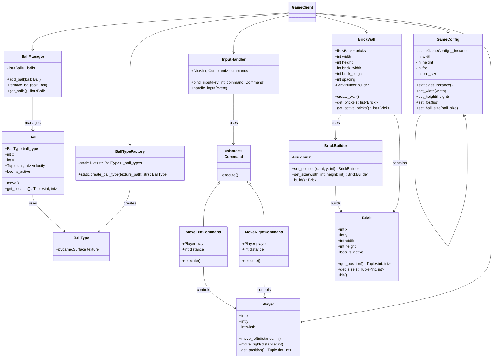

# TC3005B.501_ProyectoIntegrador_3.8
Este proyecto consiste en una imitación del juego Breakout utilizando Pygame. Se aplicaron múltiples patrones de diseño para mantener una arquitectura clara, escalable y bien estructurada.

## Requisitos del proyecto

- Implemente al menos 4 patrones de diseño.
- Incluir una justificación por patrón.
- Agregar un diagrama de clases UML del diseño.

## Justificación de Patrones de Diseño

### 1. Patrón Creacional – Singleton

#### Clase: GameConfig
#### Descripción:
Este patrón asegura que haya una única instancia global de configuración del juego (resolución, FPS, tamaño de bola, etc.), evitando la creación múltiple de configuraciones que podrían causar inconsistencias.

### 2. Patrón Estructural – Flyweight

#### Clase: BallType, Ball y Ball Factory en conjunto
Descripción:
Se usa para compartir eficientemente recursos pesados como texturas de las bolas (BallType). La fábrica evita cargar la misma textura más de una vez, ahorrando memoria y tiempo de carga.

### 3. Patrón de Comportamiento – Command
#### Clase: InputHandler

Clases involucradas: Command, MoveBallCommand, Invoker (según implementación en el notebook)
Descripción:
Se encapsulan acciones que permiten mover al jugador en objetos comando, permitiendo desacoplar la ejecución de una acción de su invocador.

### 4. Patrón Adicional – Builder

#### Clase: BrickBuilder
Descripción:
Este patrón permite construir objetos complejos como Brick paso a paso, separando la construcción de la representación final.

## Diagrama de Clases (UML)

